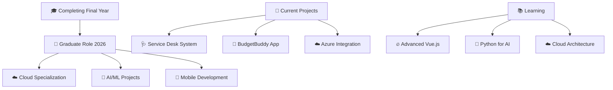

  
# 👋 Hello, I'm Cameron Chetty

  
  
  

---

## 🚀 About Me

🎓 **Final-year Computer Science Student** at IIE Varsity College  
🏆 **#1 in class** with **98% average** and **20 distinctions**  
💼 **Project Manager** leading real-world Service Desk development  
🌟 **Freelance Developer** with 2+ years of client experience  
📍 **Based in Durban, South Africa** 🇿🇦  
🌍 **Open to global graduate opportunities in 2026**  

### What drives me:
- 🔥 **Passion for problem-solving** through elegant code
- 🚀 **Love for emerging technologies** like AI and cloud computing
- 🎯 **Commitment to excellence** in everything I build
- 🤝 **Collaborative spirit** in team environments
- 📚 **Continuous learning** mindset

---

## 🔨 Featured Projects

<table>
  <tr>
    <td width="50%">
      <h3 align="center">🩺 Service Desk Solution</h3>
      

        
          
        
<strong>Real-world IT support platform for Busamed</strong>

        
Complete ticketing system with asset tracking, SLA management, and multi-channel support (email, WhatsApp, web portal)

        

          
          
          
        

        

          
        

      

    </td>
    <td width="50%">
      <h3 align="center">📱 BudgetBuddy Mobile App</h3>
      

        
          
        
<strong>Gamified personal finance tracker</strong>

        
Mobile budgeting app with cloud sync, financial goals tracking, and achievement system to make budgeting fun

        

          
          
          
        

        

          
        

      

    </td>
  </tr>
  <tr>
    <td width="50%">
      <h3 align="center">🛒 Azure E-Commerce Platform</h3>
      

        
          
        
<strong>Cloud-native inventory management system</strong>

        
Secure e-commerce platform with Azure integration for blob storage, queues, and SQL database management

        

          
          
          
        

        

          
        

      

    </td>
    <td width="50%">
      <h3 align="center">🤖 AI Recipe Assistant</h3>
      

        
          
        
<strong>WPF application with smart features</strong>

        
Recipe management system with calorie tracking, dynamic scaling, and ingredient optimization using C# and WPF

        

          
          
          
        

        

          
        

      

    </td>
  </tr>
</table>

---

## 🧠 Technical Arsenal

### 💻 Programming Languages

  
  
  
  
  
  
  

### 🚀 Frameworks & Libraries

  
  
  
  
  

### ☁️ Cloud & DevOps

  
  
  
  
  

### 🗄️ Databases

  
  
  
  
  

### 🛠️ Development Tools

  
  
  
  
  

---

## 📊 GitHub Analytics

  

---

## 🏆 Achievements & Certifications

<table>
  <tr>
    <td align="center" width="33%">
      
       <strong>🥇 #1 Student</strong>
       98% Average | 20 Distinctions
       <em>IIE Varsity College</em>
    </td>
    <td align="center" width="33%">
      
       <strong>☁️ Cloud Certified</strong>
       Google Cloud AI Innovation
       <em>LinkedIn Learning</em>
    </td>
    <td align="center" width="33%">
      
       <strong>👨‍💼 Project Leader</strong>
       Industry Service Desk Project
       <em>Work Integrated Learning</em>
    </td>
  </tr>
</table>

### 📜 Recent Certifications (2025)
- **Vue.js 3 Essential Training** - Advanced front-end framework mastery
- **Python Essential Training** - Programming fundamentals & best practices  
- **JavaScript Language** - Modern programming techniques
- **Google Cloud AI Innovation** - Artificial intelligence applications

---

## 💼 Professional Experience

<table>
  <tr>
    <td>
      <h3>🎯 Project Manager - Work Integrated Learning</h3>
      
<strong>IIE Varsity College</strong> | <em>Feb 2025 - Present</em>

      <ul>
        <li>Leading cross-functional team developing Service Desk system for Busamed</li>
        <li>Managing full SDLC using Agile methodologies</li>
        <li>Coordinating stakeholder requirements and sprint planning</li>
      </ul>
    </td>
  </tr>
  <tr>
    <td>
      <h3>💻 Freelance Developer</h3>
      
<strong>Self-Employed</strong> | <em>Jun 2023 - Present</em>

      <ul>
        <li>Architecting secure WordPress solutions with 95% security improvement</li>
        <li>Implementing SEO strategies resulting in 40% traffic increases</li>
        <li>Managing client relationships while maintaining academic excellence</li>
      </ul>
    </td>
  </tr>
  <tr>
    <td>
      <h3>🚀 Software Development Intern</h3>
      
<strong>Conversation Lab</strong> | <em>Jan 2022 - Jun 2023</em>

      <ul>
        <li>Enhanced AI chatbot accuracy by 25% using Wit.ai NLP</li>
        <li>Developed full-stack applications with responsive design</li>
        <li>Optimized database performance with complex SQL queries</li>
      </ul>
    </td>
  </tr>
</table>

---

## 🎯 Current Focus & Goals

### 🎯 2025-2026 Roadmap:
- **🎓 Complete degree** with continued excellence
- **🚀 Secure graduate developer position** in innovative company
- **☁️ Obtain Azure certifications** for cloud specialization
- **🤖 Dive deeper into AI/ML** applications
- **🌍 Contribute to open-source** projects

---

## 🌐 Let's Connect & Collaborate!

  
  
  
  

 **Always open to:**
- 🤝 **Collaborations** on exciting projects
- 💡 **Open-source contributions** 
- 🎯 **Graduate developer opportunities**
- 🌟 **Innovative tech discussions**

---

  

